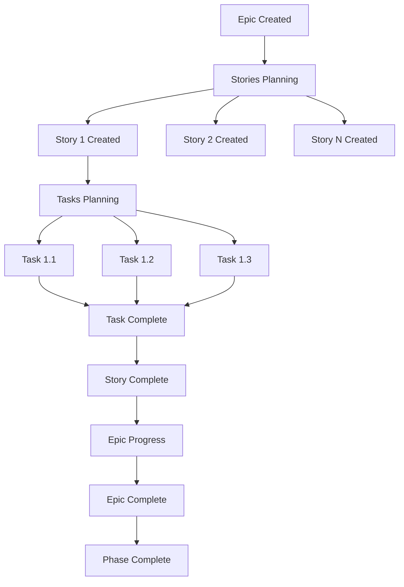

# Issue & Milestone 管理ガイド

**生成日**: 2025-09-27
**目的**: Epic/Story/Task の使い分けとマイルストーン運用ガイドライン

## 🎯 Issue 階層構造の詳細定義

### 📊 **階層レベルの特徴**

| レベル | 範囲 | 期間 | 担当者 | 成果物 | 例 |
|--------|------|------|--------|--------|-----|
| **Epic** | Phase 全体 | 1-16週間 | Phase Lead | Phase 完了 | Docker Foundation 全体 |
| **Story** | 機能群 | 3-10日 | 開発チーム | 動作する機能 | DevContainer セットアップ |
| **Task** | 具体作業 | 0.5-3日 | 個人 | 完了した作業項目 | Dockerfile 作成 |

---

## 🏗️ **Epic レベル管理**

### Epic の定義と特徴

**Epic とは**: Phase レベルの大規模な機能開発の包括的な追跡 Issue

### Epic 作成ガイドライン

#### **必須要素**
- **タイトル**: `[EPIC] Phase X: 機能名`
- **ラベル**: `epic:phase-X` + `constitutional:identity-preservation`
- **マイルストーン**: 対応する Phase マイルストーン
- **説明**: Phase の全体目標と成功条件

#### **Epic テンプレート**
```markdown
# Epic: Phase X - 機能名

## 🎯 Epic 目標
[Phase の全体的な目標を記述]

## 📋 含まれる Story 一覧
- [ ] #XX Story 1: 機能A開発
- [ ] #XX Story 2: 機能B統合
- [ ] #XX Story 3: テスト・検証

## 🏁 Phase 完了条件
- [ ] 全Story完了
- [ ] 品質基準達成
- [ ] 憲法遵守確認
- [ ] 次Phase準備完了

## 📊 成功指標
[定量的な成功指標]

## 🔗 関連リソース
- PinkieIt Pattern: [commit hash]
- 分析文書: [docs/analysis/ へのリンク]
```

---

## 📖 **Story レベル管理**

### Story の定義と特徴

**Story とは**: ユーザー価値を提供する機能開発の論理的まとまり

### Story 作成ガイドライン

#### **必須要素**
- **タイトル**: `[STORY] 機能名: 詳細説明`
- **ラベル**: `epic:phase-X` + `story:カテゴリ` + 憲法ラベル
- **説明**: ユーザーストーリー形式
- **受け入れ条件**: 明確な完了定義

#### **Story テンプレート**
```markdown
# Story: 機能名

## 👤 ユーザーストーリー
**As a** [ユーザータイプ]
**I want** [機能・能力]
**So that** [ビジネス価値・目的]

## 📋 含まれる Task 一覧
- [ ] #XX Task 1: 設計・計画
- [ ] #XX Task 2: 実装
- [ ] #XX Task 3: テスト・検証

## ✅ 受け入れ条件 (Definition of Done)
- [ ] 機能が期待通りに動作する
- [ ] テストが全て通る
- [ ] ドキュメントが更新されている
- [ ] コードレビューが完了している
- [ ] 憲法要件を満たしている

## 🔗 PinkieIt Reference
Commit: [関連するPinkieItコミットハッシュ]

## 🎯 Story ポイント
[実装難易度: 1-8ポイント]
```

---

## ⚙️ **Task レベル管理**

### Task の定義と特徴

**Task とは**: Story 実現のための具体的で測定可能な作業単位

### Task 作成ガイドライン

#### **必須要素**
- **タイトル**: `[TASK] 具体的な作業名`
- **ラベル**: `epic:phase-X` + `story:カテゴリ` + `task:タイプ`
- **説明**: 詳細な作業手順
- **完了定義**: 明確で検証可能

#### **Task テンプレート**
```markdown
# Task: 具体的な作業名

## 🎯 Task 目的
[この Task で何を達成するか]

## 📋 作業手順
1. [ ] ステップ1の詳細
2. [ ] ステップ2の詳細
3. [ ] ステップ3の詳細

## ✅ 完了条件
- [ ] 具体的な成果物が作成されている
- [ ] 動作確認が完了している
- [ ] 関連文書が更新されている

## 🕒 想定工数
[0.5-3日]

## 🔗 関連情報
- Parent Story: #XX
- 参考資料: [リンク]
```

---

## 🗓️ **マイルストーン管理**

### 現在のマイルストーン構成

| マイルストーン | バージョン | 状態 | 期間 | 完了条件 |
|----------------|------------|------|------|----------|
| **Phase 0: Repository Setup** | v0.1.0 | ✅ 完了 | 完了済み | GitHub インフラ構築 |
| **Phase 1: Docker Foundation** | v0.2.0 | 🔄 進行中 | 4週間 | Docker + Development Environment |
| **Phase 2: Quality Infrastructure Day** | v0.3.0 | ⏳ 計画中 | 1日 | テスト・品質ツール導入 |
| **Phase 3: Comprehensive Testing** | v0.4.0 | ⏳ 計画中 | 2週間 | >60% テストカバレッジ |
| **Phase 4: Framework Modernization** | v0.5.0 | ⏳ 計画中 | 1週間 | Laravel 10.x + PHP 8.2 |
| **Phase 5: Advanced Docker Optimization** | v0.6.0 | ⏳ 計画中 | 1週間 | Multi-architecture ビルド |
| **Phase 6: CI/CD Integration** | v1.0.0 | ⏳ 計画中 | 1週間 | 完全自動化パイプライン |

### マイルストーン完了条件

#### **Phase 1 完了条件**
```bash
✅ Docker containerization operational
✅ All models in app/Models/ directory
✅ Basic CI/CD pipeline functional
✅ Test framework configured
```

#### **Phase 2-3 完了条件**
```bash
✅ >60% test coverage achieved
✅ All quality tools operational
✅ Static analysis passing
```

#### **Phase 4-5 完了条件**
```bash
✅ Laravel 10.x migration successful
✅ Docker multi-stage optimization
✅ Real-time features validated
```

#### **Phase 6 完了条件**
```bash
✅ Multi-architecture CI/CD operational
✅ All PinkieIt patterns successfully applied
✅ YokaKit identity preserved throughout
```

---

## 🔄 **Issue ワークフロー**

### Epic → Story → Task の流れ



### ステータス遷移

```bash
needs-triage → in-progress → blocked (必要時) → in-progress → closed
```

---

## 📊 **Issue 進捗追跡**

### Epic レベル追跡

```bash
# Epic の全体進捗
gh issue list --milestone="Phase 1: Docker Foundation" --state=all

# Epic 内の Story 進捗
gh issue list --label="epic:phase-1" --label="story:feature"
```

### Story レベル追跡

```bash
# Story の Task 完了率
gh issue list --label="story:feature" --state=closed

# ブロックされた Story
gh issue list --label="story:feature" --label="status:blocked"
```

### 日次進捗レポート

```bash
# 今日完了した Task
gh issue list --state=closed --search="closed:$(date +%Y-%m-%d)"

# 進行中の作業
gh issue list --label="status:in-progress"
```

---

## 🎯 **Issue 作成のベストプラクティス**

### ✅ **良い Issue の例**

#### Epic 例
```markdown
タイトル: [EPIC] Phase 1: Docker Foundation & Development Environment
ラベル: epic:phase-1, constitutional:identity-preservation
マイルストーン: Phase 1: Docker Foundation

明確な Phase 目標と成功条件が記載されている
```

#### Story 例
```markdown
タイトル: [STORY] DevContainer: VS Code development environment setup
ラベル: epic:phase-1, story:feature, constitutional:quality-first

ユーザーストーリー形式で価値が明確
受け入れ条件が具体的
```

#### Task 例
```markdown
タイトル: [TASK] Create .devcontainer/devcontainer.json configuration
ラベル: epic:phase-1, story:feature, task:implementation

具体的な作業内容と完了条件
1-3日で完了可能な範囲
```

### 🚫 **避けるべき Issue パターン**

```bash
# 曖昧すぎる Task
❌ [TASK] Docker の設定
✅ [TASK] Create Dockerfile with PHP 8.2 + Apache configuration

# 大きすぎる Story
❌ [STORY] Laravel 全体のアップグレード
✅ [STORY] Laravel 10.x: Framework core migration

# 憲法ラベル不足
❌ epic:phase-1, story:feature
✅ epic:phase-1, story:feature, constitutional:identity-preservation
```

---

## 📋 **Issue 作成チェックリスト**

### Epic 作成時
- [ ] Phase 全体の目標が明確
- [ ] 含まれる Story の概要がリストアップ
- [ ] 憲法要件（特に identity-preservation）が記載
- [ ] 対応するマイルストーンが設定
- [ ] PinkieIt パターンへの参照あり

### Story 作成時
- [ ] ユーザーストーリー形式で記載
- [ ] 受け入れ条件が明確で検証可能
- [ ] 3-10日で完了可能な範囲
- [ ] 適切な Story ラベル選択
- [ ] Epic との関連が明確

### Task 作成時
- [ ] 具体的で測定可能な作業内容
- [ ] 1-3日で完了可能
- [ ] 詳細な手順または参考資料
- [ ] 明確な完了条件
- [ ] Story との関連が明確

---

## 📚 **関連ドキュメント**

- [Label Guide](./LABEL_GUIDE.md) - ラベル体系と使用方法
- [Strategic Master Plan](../analysis/timeline/development-timeline-analysis.md) - Phase 詳細計画
- [Constitutional Requirements](../../CLAUDE.md#constitutional-requirements) - 憲法要件
- [GitHub運用方針](../../README.md#github運用方針) - 全体運用ルール

---

**最終更新**: 2025-09-27
**管理責任者**: プロジェクトリード
**レビュー周期**: Phase 完了時