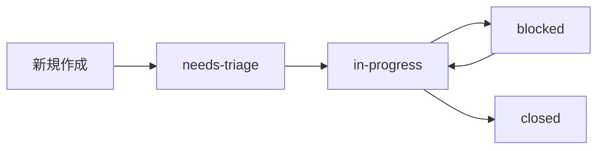

# GitHub 管理・運用ガイド

**生成日**: 2025-09-27
**目的**: YokaKit_Replay プロジェクトの GitHub 管理体系の概要

## 🎯 GitHub 管理体系概要

YokaKit_Replay では、**憲法遵守**を基盤とした体系的な GitHub 管理を実施しています。

### 📊 **管理の4つの柱**

| 管理領域 | 目的 | 主要コンポーネント |
|----------|------|------------------|
| **ラベル管理** | Issue の階層化・分類 | Epic/Story/Task/Constitutional |
| **Issue管理** | 作業の構造化・追跡 | テンプレート、ワークフロー |
| **マイルストーン管理** | Phase 進捗の可視化 | Phase 0-6 の完了条件 |
| **憲法遵守** | プロジェクト原則維持 | Identity Preservation, Historical Fidelity |

---

## 🏷️ **ラベル階層システム**

### 4層階層構造

```text
Epic (Phase レベル) 4-16週間
├── Story (機能群) 3-10日
│   ├── Task (具体作業) 0.5-3日
│   ├── Task (具体作業) 0.5-3日
│   └── Task (具体作業) 0.5-3日
└── Constitutional (憲法要件) 全期間
```

### ラベル統計 (現在)

| カテゴリ | ラベル数 | 例 |
|----------|----------|-----|
| Epic | 7個 | `epic:phase-0` ～ `epic:phase-6` |
| Story | 5個 | `story:feature`, `story:security` |
| Task | 3個 | `task:implementation`, `task:validation` |
| Constitutional | 4個 | `constitutional:identity-preservation` |
| Status | 3個 | `status:in-progress`, `status:blocked` |
| Standard | 9個 | `bug`, `enhancement`, `documentation` |

**詳細**: [ラベル管理ガイド](./LABEL_GUIDE.md)

---

## 📋 **Issue 管理システム**

### Issue 階層と責任範囲

| レベル | 担当者 | 期間 | 成果物 | 追跡方法 |
|--------|--------|------|--------|----------|
| **Epic** | Phase Lead | 1-16週間 | Phase 完了 | マイルストーン |
| **Story** | 開発チーム | 3-10日 | 動作する機能 | Epic 内追跡 |
| **Task** | 個人 | 0.5-3日 | 完了した作業項目 | Story 内チェックリスト |

### Issue テンプレート構成

- **Feature Request**: 憲法遵守フィールド付き機能要求
- **Bug Report**: 標準的な不具合報告
- **General Inquiry**: 質問・相談用

**詳細**: [Issue & Milestone ガイド](./ISSUE_MILESTONE_GUIDE.md)

---

## 🗓️ **マイルストーン構成**

### Phase 構成と完了条件

| Phase | バージョン | 期間 | 状態 | 完了条件 |
|-------|------------|------|------|----------|
| **Phase 0** | v0.1.0 | 完了済み | ✅ | GitHub インフラ構築 |
| **Phase 1** | v0.2.0 | 4週間 | 🔄 | Docker + Development Environment |
| **Phase 2** | v0.3.0 | 1日 | ⏳ | Quality Infrastructure Day |
| **Phase 3** | v0.4.0 | 2週間 | ⏳ | >60% テストカバレッジ |
| **Phase 4** | v0.5.0 | 1週間 | ⏳ | Laravel 10.x + PHP 8.2 |
| **Phase 5** | v0.6.0 | 1週間 | ⏳ | Multi-architecture ビルド |
| **Phase 6** | v1.0.0 | 1週間 | ⏳ | 完全自動化パイプライン |

---

## ⚖️ **憲法遵守システム**

### 必須憲法ラベル

| ラベル | 重要度 | 適用範囲 | 説明 |
|--------|--------|----------|------|
| `constitutional:identity-preservation` | **NON-NEGOTIABLE** | 全 Issue | YokaKit アイデンティティ維持 |
| `constitutional:historical-fidelity` | 高 | リプレイ関連 | PinkieIt 歴史的忠実性 |
| `constitutional:quality-first` | 高 | 実装関連 | 品質ファースト実装 |
| `constitutional:compliance` | 中 | 全般 | 一般的憲法遵守 |

### 憲法チェックポイント

```bash
# 全 Issue の identity-preservation チェック
gh issue list --label="constitutional:identity-preservation"

# Phase 完了時の憲法遵守確認
gh issue list --milestone="Phase X" --label="constitutional:compliance" --state=closed
```

---

## 🔄 **ワークフロー管理**

### Issue ライフサイクル



### 日次運用チェックリスト

#### 毎日
- [ ] `status:needs-triage` Issue の確認・アサイン
- [ ] `status:blocked` Issue のブロッカー状況確認
- [ ] 完了した Task の Story 内チェックリスト更新

#### 週次
- [ ] Story レベルの進捗確認
- [ ] Epic 内の Story 完了率確認
- [ ] マイルストーン進捗の可視化

#### Phase 完了時
- [ ] 全憲法要件の遵守確認
- [ ] マイルストーン完了条件の検証
- [ ] 次 Phase への準備確認

---

## 📊 **進捗追跡・レポート**

### 推奨レポートクエリ

```bash
# Epic 進捗レポート
gh issue list --milestone="Phase 1" --state=all

# Story 完了率
gh issue list --label="story:feature" --state=closed

# 憲法遵守状況
gh issue list --label="constitutional:identity-preservation"

# ブロックされた作業
gh issue list --label="status:blocked"

# 今日の完了作業
gh issue list --state=closed --search="closed:$(date +%Y-%m-%d)"
```

### GitHub Insights 活用

- **Issues タブ**: 全体的な Issue 分布
- **Projects タブ**: Kanban ボードでの可視化
- **Milestones タブ**: Phase 進捗の確認
- **Labels タブ**: ラベル使用統計

---

## 🎯 **ベストプラクティス**

### ✅ **推奨パターン**

#### Issue 作成時
1. 適切な階層レベル（Epic/Story/Task）を選択
2. 憲法ラベル（特に identity-preservation）を必ず付与
3. 明確で測定可能な完了条件を定義
4. 関連する PinkieIt コミットハッシュを参照

#### ラベル運用時
1. 1つの Issue に複数の Epic ラベル禁止
2. Story と Task の同時使用禁止
3. Constitutional ラベルの適切な選択
4. Status ラベルのタイムリーな更新

### 🚫 **避けるべきパターン**

```bash
# 悪い例
❌ epic:phase-1 + epic:phase-2  # 複数Phase
❌ story:feature + task:implementation  # 階層混在
❌ Bug report without constitutional label  # 憲法ラベル不足

# 良い例
✅ epic:phase-1 + constitutional:identity-preservation
✅ epic:phase-1 + story:feature + constitutional:quality-first
✅ epic:phase-1 + story:feature + task:implementation + status:in-progress
```

---

## 🔧 **管理ツール・自動化**

### GitHub CLI 活用

```bash
# 毎日の triaging
gh issue list --label="status:needs-triage"

# 進捗確認
gh issue list --milestone="Phase 1" --state=open

# 憲法遵守チェック
gh issue list --label="constitutional:identity-preservation" --state=open
```

### 推奨 GitHub Extensions

- **gh-dash**: Issue/PR ダッシュボード
- **gh-project**: Project board 管理
- **gh-milestone**: マイルストーン操作

---

## 📚 **関連ドキュメント**

### 管理ガイド
- [ラベル管理ガイド](./LABEL_GUIDE.md) - 詳細なラベル体系と使用方法
- [Issue & Milestone ガイド](./ISSUE_MILESTONE_GUIDE.md) - Epic/Story/Task の詳細定義

### プロジェクト全体
- [戦略マスタープラン](../analysis/timeline/development-timeline-analysis.md) - Phase 詳細計画
- [Constitutional Requirements](../../CLAUDE.md#constitutional-requirements) - 憲法要件
- [GitHub運用方針](../../README.md#github運用方針) - 全体運用ルール

---

## 🔄 **継続的改善**

### 管理体系の見直し周期

| 対象 | 見直し周期 | トリガー |
|------|------------|----------|
| **ラベル体系** | Phase 完了時 | 新しい Story/Task カテゴリ必要時 |
| **Issue テンプレート** | 四半期 | 憲法改正時 |
| **マイルストーン** | Phase 開始時 | スコープ変更時 |
| **ワークフロー** | 月次 | 効率性改善必要時 |

### フィードバック収集

- Phase 完了時の振り返り会議
- 週次の運用改善提案
- 憲法遵守の課題点収集
- GitHub 機能更新への対応

---

**最終更新**: 2025-09-27
**管理責任者**: プロジェクトリード
**レビュー周期**: Phase 完了時